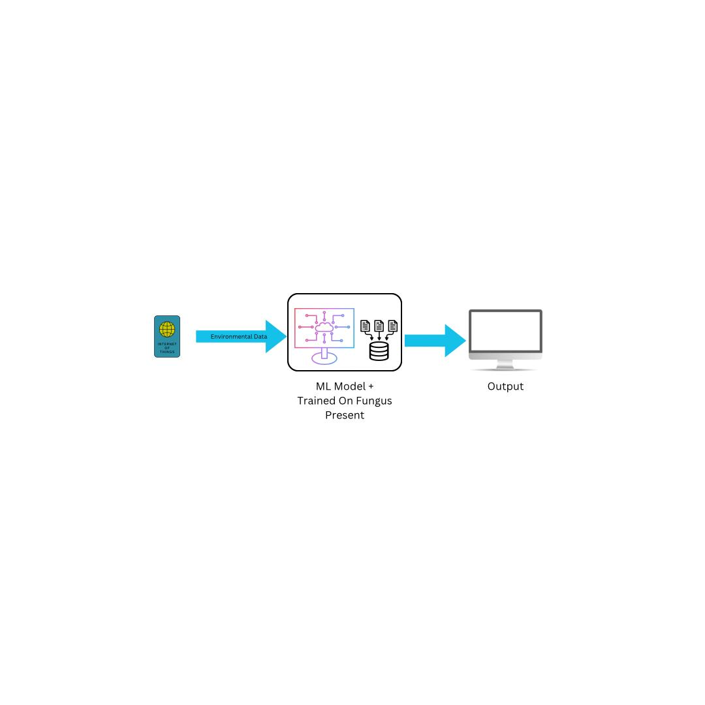

# Fungus Detection Through IoT and ML

Welcome to the **Fungus Detection Through IoT and ML** project! This project leverages Internet of Things (IoT) technology and Machine Learning (ML) to detect the presence of fungus in a room based on environmental data. 

## Project Overview

Fungus growth can be a significant problem, especially in indoor environments. Our system uses various sensors to collect environmental data and a machine learning model to analyze this data and determine whether fungus is present in the room.

### Key Features

- **Real-time Environmental Monitoring:** Collect data on Temperature, CO, C4H10 (Butane), Light Intensity, Humidity, NH3 (Ammonia), and CH4 (Methane).
- **Fungus Detection:** Use a pre-trained machine learning model to analyze sensor data and detect fungus presence.
- **IoT Integration:** Seamless integration of sensors with the detection system through IoT.

## File Structure

Here’s a brief overview of the project structure:

- `Datasets/`: Contains the datasets used for training and testing the machine learning model.
- `IOT/`: Contains files related to IoT integration and sensor data collection.
- `models/`: Includes the trained machine learning models used for fungus detection.
- `notebook/`: Jupyter notebooks used for data analysis and model training.
- `static/`: Static files such as images or other resources.
- `template/`: Templates for UI or other purposes.
- `app.py`: The main application script that integrates the sensor data with the ML model for real-time fungus detection.

## System Architecture

The system architecture consists of:

1. **Sensors:** Collect environmental data such as Temperature, CO, C4H10, Light Intensity, Humidity, NH3, and CH4.
2. **Data Transmission:** The collected data is sent to the cloud or local server via IoT protocols.
3. **Machine Learning Model:** Analyzes the transmitted data to determine the presence of fungus.
4. **Detection Output:** Provides results on whether fungus is detected in the room or not.



## How It Works

1. **Data Collection:** Sensors continuously collect environmental data and send it to the application.
2. **Data Processing:** The application processes the data and feeds it to the machine learning model.
3. **Fungus Detection:** The model analyzes the data and predicts whether fungus is present.
4. **Results Display:** The results are displayed to the user, indicating the presence or absence of fungus.

## Getting Started

To get started with this project:

1. **Clone the Repository:**

    ```bash
    git clone https://github.com/chandraparsad3/Hackathons2.0.git
    ```

2. **Navigate to the Project Directory:**

    ```bash
    cd Hackathons2.0/Fungus_Detection
    ```

3. **Install Dependencies:**

    Install the required libraries manually using `pip`. For example:

    ```bash
    pip install numpy pandas scikit-learn flask
    ```

    Add any additional libraries that your project may use.

4. **Run the Application:**

    Start the application by running:

    ```bash
    python app.py
    ```

5. **Access the Results:**

    Follow the instructions in the application to view the fungus detection results.
